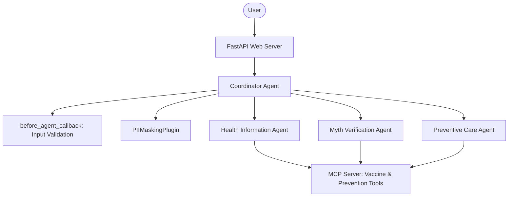

# Implementation Plan: Public Health Awareness Agent

This plan outlines the architecture and implementation details for building a **Public Health Awareness Agent** using Google's Agent Development Kit (ADK). The system will act as a trusted assistant, providing disease info, verifying health myths, and recommending preventive habits, supported by a custom MCP server and a modern visual web dashboard.

---

## User Review Required

Please review the following design decisions before we proceed:

1. **Model Selection**: We will use `gemini-2.5-flash` (or the default recommended model from ADK) to power our LLM agents, ensuring fast responses and high tool-calling/delegation reliability.
2. **Local MCP Server integration**: The MCP server will run as a subprocess (connected via Stdio) managed by the ADK `McpToolset`. This ensures zero complex configuration for the user.
3. **Vanilla Frontend**: We will implement the frontend with HTML5, modern Vanilla CSS (using variables, glassmorphism, responsive grid, and custom keyframe animations), and ES6 JavaScript. This avoids npm build overhead while providing a premium, interactive, and responsive UI.

---

## Proposed Architecture

We will implement a multi-agent coordinator-delegator pattern:



---

## Proposed Changes

We will scaffold the project inside `c:\Users\sc\Documents\Capstone_project\health-agent`.

### 1. Project Initialization & Scaffolding

We will initialize the project using the CLI tool:
```bash
agents-cli scaffold create health-agent --agent adk --prototype
```
This generates the boilerplate structure. We will modify/add the files below.

---

### 2. Code Implementation

#### [NEW] [mcp_server.py](file:///c:/Users/sc/Documents/Capstone_project/health-agent/app/mcp_server.py)
A Python MCP server implementing tools using `mcp.server.fastmcp`:
*   `retrieve_disease_info(disease: str) -> str`: Factual database lookup (causes, symptoms, prevention, when to seek care) for Dengue, Influenza, Diabetes, Heat Stroke, etc.
*   `verify_health_myth(claim: str) -> str`: Factual evaluation of common myths (e.g. antibiotics curing viruses).
*   `get_vaccination_schedule(age_group: str) -> str`: Structured schedules for infants, children, and adults.
*   `get_preventive_guidelines(topic: str) -> str`: Healthy habits and prevention guidelines.

#### [MODIFY] [agent.py](file:///c:/Users/sc/Documents/Capstone_project/health-agent/app/agent.py)
Contains definitions for the agents using ADK:
*   `HealthCoordinatorAgent`: Root agent with sub-agents list. Evaluates user intent, routes queries, handles initial input validation, and appends a standard medical advice disclaimer.
*   `HealthInfoAgent`: Sub-agent for explanations. Binds to MCP tool `retrieve_disease_info`.
*   `MythVerificationAgent`: Sub-agent for myths. Binds to MCP tool `verify_health_myth`.
*   `PreventiveCareAgent`: Sub-agent for vaccination & habit planning. Binds to MCP tools `get_vaccination_schedule` and `get_preventive_guidelines`.

#### [NEW] [security.py](file:///c:/Users/sc/Documents/Capstone_project/health-agent/app/security.py)
Implements safety constraints and security compliance:
*   `validate_user_input(text: str)`: Callback/helper that runs before processing. Rejects scripts, injection attempts, or inappropriate text.
*   `PIIMaskingPlugin`: A custom ADK plugin (`BasePlugin`) that overrides `before_model_callback` and `on_event_callback` to mask emails, phone numbers, and potential PII in logs/prompts using Regex.
*   `InMemorySessionService` configuration to guarantee no user health info is stored on disk permanently.

#### [NEW] [web_server.py](file:///c:/Users/sc/Documents/Capstone_project/health-agent/app/web_server.py)
FastAPI backend that:
*   Sets up the ADK `Runner` and `SessionService`.
*   Exposes a WebSocket endpoint `/chat` or POST endpoint `/query` that runs the agent and yields events (including tool calls, agent transfers, thinking processes, and logs).
*   Serves the static web files for the dashboard.

#### [NEW] [static/index.html](file:///c:/Users/sc/Documents/Capstone_project/health-agent/app/static/index.html)
The dashboard HTML interface featuring:
*   A chat area for entering questions and viewing conversation.
*   A visual workspace mapping the agent network (`Coordinator` -> `HealthInfo`, `MythVerification`, `PreventiveCare`).
*   A live reasoning panel displaying tool execution steps, LLM thought processes, and PII masking logs.

#### [NEW] [static/style.css](file:///c:/Users/sc/Documents/Capstone_project/health-agent/app/static/style.css)
A highly premium CSS design:
*   Modern dark mode layout with custom fonts (Google Fonts: Outfits & Inter).
*   Glassmorphism card designs with subtle shadows.
*   Pulsing active states for agents and glowing animation effects during execution.
*   Fully responsive grid layout.

#### [NEW] [static/app.js](file:///c:/Users/sc/Documents/Capstone_project/health-agent/app/static/app.js)
Frontend logic to:
*   Handle WebSockets/SSE streaming.
*   Parse events to dynamically highlight active agents, render reasoning timelines, and update chat logs.

#### [NEW] [run_app.py](file:///c:/Users/sc/Documents/Capstone_project/health-agent/run_app.py)
A convenient python script to start the backend server and open the web dashboard:
```python
import uvicorn
if __name__ == "__main__":
    uvicorn.run("app.web_server:app", host="127.0.0.1", port=8000, reload=True)
```

---

## Verification Plan

### Automated Tests
1. **Linting and Typing**:
   Run `agents-cli lint` to check for syntax and type issues.
2. **Behavioral Evaluation**:
   Create a test dataset `tests/eval/datasets/health_eval.json` with the requested queries.
   Configure evaluation metrics (relevance, accuracy, disclaimer presence) in `tests/eval/eval_config.yaml`.
   Run:
   ```bash
   agents-cli eval run
   ```

### Manual Verification
1. Run `python run_app.py` and open `http://127.0.0.1:8000`.
2. Test the following scenarios:
   *   **Symptoms Check**: "What are the symptoms of dengue fever?" -> Verify Health Information Agent is activated, tool-call is run, and symptoms are displayed.
   *   **Myth Busting**: "Is it true that antibiotics cure viral infections?" -> Verify Myth Verification Agent is activated.
   *   **Habit/Prevention**: "How can I prevent heat stroke during summer?" -> Verify Preventive Care Agent handles it.
   *   **Security (PII)**: "My name is John Doe, email john@example.com. What vaccinations are recommended for kids?" -> Verify the final logs mask the email/name, and that personal data isn't persisted.
   *   **Input Injection Check**: Input a script or injection prompt and verify the coordinator rejects it safely.
